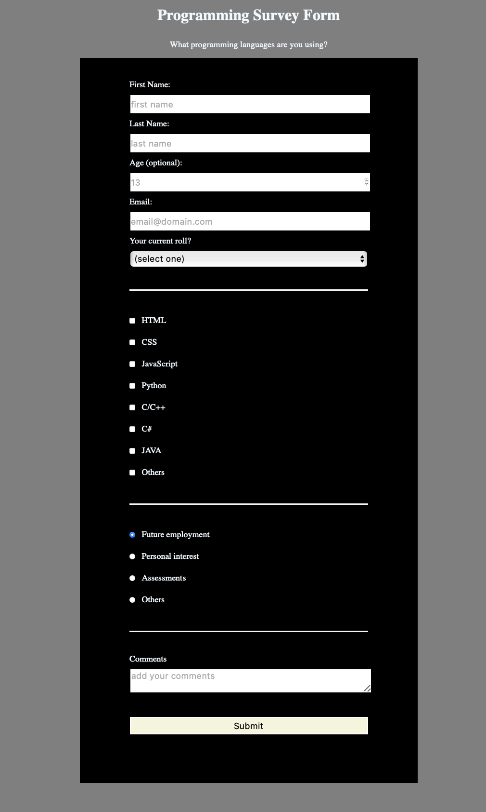

# Responsive Web Design:   \<PJ-01-Survey Form\>

## Overview

This project focuses on learning the basic structure of HTML and practicing CSS selectors.

## Table of Contents

- [Overview](#overview)
- [Advantages for this project](#advantages-for-this-project)
- [Challenges Encountered](#challenges-encountered)
- [Problem-solving Techniques](#problem-solving-techniques)
- [References](#references)
- [Conclusion](#conclusion)

  

## Advantages for this project

|                     **HTML**                     |         **CSS**          |
| :----------------------------------------------: | :----------------------: |
|                 Basic structure                  |    Selecting targets     |
|                     Heading                      |         Padding          |
|                      Title                       |          Border          |
|                  Meta: charset                   |          Margin          |
|                       Link                       |          Align           |
|                       Form                       | Color / Background-Color |
|                      Input                       |
|                 Validating input                 |
| Giving attributes  (id, value, for, name ...) |

  

## Challenges Encountered

This was my first HTML and CSS project that required me to write code entirely on my own. While I tried to apply what I had learned and include as much as possible, I found that I missed many attributes and elements. After receiving feedback, I went back to review previous lectures and practiced again.

One of the main challenges I faced was understanding how to structure the code and apply the correct attributes without explicit instructions. This project taught me that even though it may be challenging, experimenting with code and learning from mistakes is an essential part of the learning process.

I realized that incorrect or missing code can be fixed, and continuous improvement is key to writing better code. It also taught me not to stress about creating perfect code on the first try, but rather to focus on learning and improving with each attempt.

## Problem-solving Techniques

When facing difficulties or confusion, I frequently rely on Google to seek the information I require. 

Moreover, when seeking deeper comprehension, I turn to chatGPT, requesting explanations to aid in my self-study journey. 

This approach has proven invaluable in helping me navigate complex topics more effectively, considering my current level of understanding.

## References

- [chatGPT](https://chat.openai.com/)   
- [freeCodeCamp](https://freecodecamp.org)

## Conclusion
Through the challenges encountered in my first HTML and CSS project, I've learned valuable lessons about the learning process itself. 

This experience has taught me the importance of perseverance, adaptability, and humility when navigating new territories in coding. 

By embracing mistakes as opportunities for growth and utilizing resources like Google and chatGPT, I've developed problem-solving skills that continue to strengthen my abilities as a developer. 

Moving forward, I am committed to approaching coding projects with a mindset of continuous improvement, focusing not on perfection but on the journey of learning and refinement.
